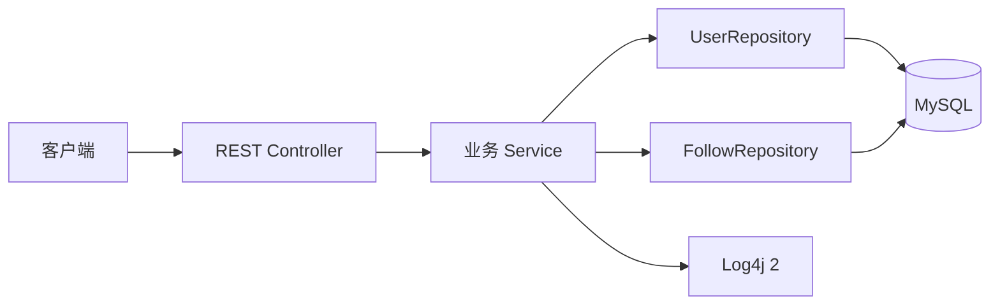
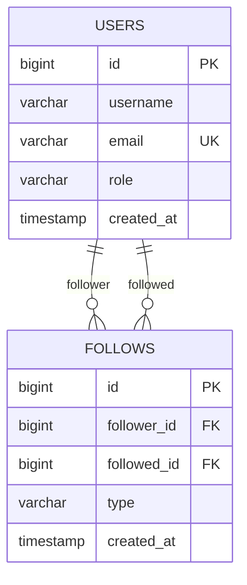
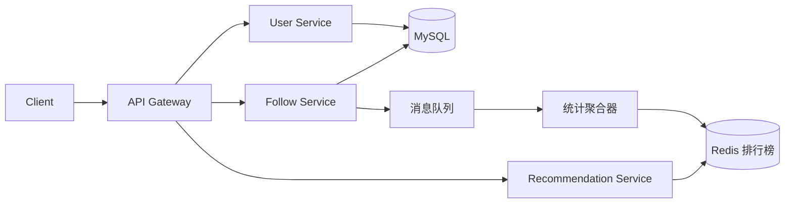

# 系统设计与演进路线

## 当前可运行架构

## 两表 ER 图

## 面向图中大规模系统的演进

学习顺序：

1. 单体两表 CRUD、事务、测试和日志（当前阶段）。
2. Flyway 管理表结构，Testcontainers 做真实数据库集成测试。
3. 分页、索引、JPQL、N+1 与事务并发。
4. Spring Security + JWT，密码必须哈希而不是明文保存。
5. Redis 缓存推荐榜，讨论缓存穿透、击穿和一致性。
6. Kafka/RabbitMQ 异步更新计数，讨论最终一致性和幂等。
7. 最后再拆服务；先理解边界，再承担分布式系统复杂度。
